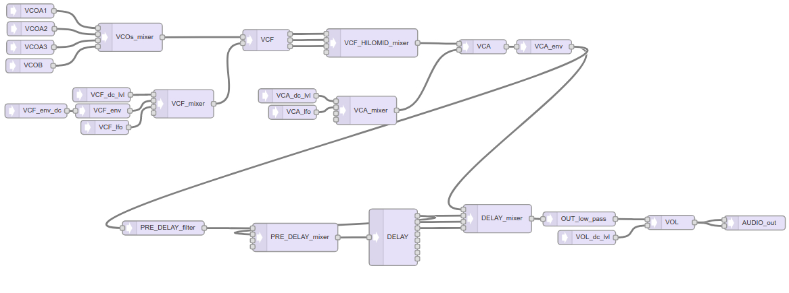

# drameSYNTH
## Teensy3.6 Midi-Synth intend to be like my poliVoks ( but is not )

I use it as my DRAME-band Polivoks poor-spare...

It fit inside my "Graphite-49" cheap midi keyboard.
I use the uart-midi input (but can easily work with usb-midi)

- 1 + 3 VCOs in a sort of duo-phony, several waveforms
- Chamberlin VCF with Freq & Q
- VCF with dc level & LFO & ADSR & note-follow
- VCA with LFO & ADSR
- MultiTap Delay
- Hold notes
- "Analog" trigg input (with sustain-pedal input)
- "Auto trigg function" with tap-tempo divider & trigg lenght control

This massively use the Teensy audio-lib



#### To visualize the synth structure:
import "guiTool.h" in Audio System Design Tool for Teensy Audio Library
at https://www.pjrc.com/teensy/gui/index.htm

#### Midi Control Change:
List of controls change ( CC ) in  "midi_CC_patch.h"

  ```
     ____     __          ______              _       ____ ___  ___  ___
    / __/_ __/ /___ _____/_  __/______  ___  (_)___  |_  // _ \/ _ \/ _ \
   / _// // / __/ // / __// / / __/ _ \/ _ \/ / __/ _/_ </ // / // / // /
  /_/  \_,_/\__/\_,_/_/  /_/ /_/  \___/_//_/_/\__/ /____/\___/\___/\___/ 
                                                                         
with love.
```
